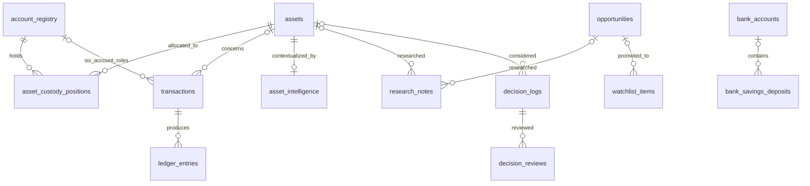

# TNPA Investment OS — Current State v2.1.4 Audit

Audit date: 2026-09-28. Repository: `tnpa-investment-os`. Verified branch: `feature/asset-workspace-engine`. Verified HEAD: `128e6b9328f37e2446ba8ba9e152a19461c0c61d`, matching tag `v2.1.4-family-office-navigation`.

Scope: read-only repository audit, with this document as the sole repository change. No application changes, dependency installation/update, migration, seed, deployment, commit, or push was performed. Source, scripts, schema, configuration, lockfile, route tree, relevant documentation and tag diff were inspected. The existing local database was opened with SQLite `mode=ro` to inspect schema metadata only. Public security documentation and npm's advisory registry were consulted; npm received dependency metadata, not financial records. Runtime UI flows were not exercised. The user's reported lint and compilation results were not independently rerun; rebuilding could create private build artifacts and was unnecessary to establish the failure.

## 1. Executive Summary

**Preserve and evolve the existing Next.js + Drizzle + local SQLite application. A framework or database rewrite is not required to extend its wealth registry. It is not yet a reliable, strictly local-only wealth system.**

The repository contains substantial working manual workflows: holdings, banking, deposits, credit usage, stock and crypto custody, transaction lifecycle, allocation, buckets, rebalancing, opportunities, research, decisions, review calendar and snapshots. Several specialized workspaces are generic asset forms with domain details stored in notes. Bonds, recurring income, general expenses, and private-business ownership are not implemented as independent domains.

Highest-priority findings:

1. **Confirmed fresh-database failure:** the repository's `tnpa-investment.db` exists but is **zero bytes and has no tables**. `.env` and `.env.local` are absent; `DATABASE_URL`, `TURSO_DATABASE_URL` and `TURSO_AUTH_TOKEN` are unset in the audit shell. The future `~/.tnpa-wealth-os/database/wealth.db` does not exist. The two export handlers execute SQL during Next.js 14 build prerendering and encounter the missing `assets` table.
2. **Initialization has a trap:** `npm run db:migrate` creates the schema but also inserts example financial accounts, balances, securities, transactions, custody positions and ledger entries. It is not an empty-production initializer. `npm run db:seed` is destructive and hardcodes the repository database path. The existing `db:push` command is the safer schema-only option for a guarded, completely new database.
3. **Financial totals can disagree:** lifecycle transactions modify `account_registry.current_balance`; portfolio aggregation uses `bank_accounts` and other banking tables, not registry cash. Locations also sum mixed currencies without normalization. These are material accounting defects, not missing visual polish.
4. **Backup/restore is incomplete and internally incompatible:** JSON v5 omits all four banking tables and four older tables; wallet addresses are browser-local. The Settings import UI accepts only v1, although the API accepts v1–v5. Restore deletes and reinserts data without an encompassing transaction.
5. **Privacy is configurable, not enforced:** remote libSQL/Turso URLs are accepted and take precedence over local configuration. Start scripts do not bind explicitly to loopback. There is no app authentication. Google font downloads and Next telemetry are external connections; cloud deployment guidance remains active in the UI/docs.
6. **Dependency audit reproduced exactly 16 vulnerable package entries:** 1 low, 5 moderate, 9 high, 1 critical. Next.js 14.2.29, Drizzle ORM, Drizzle Kit, eslint-config-next and PostCSS are direct affected dependencies. Several remediations require compatibility work; do not run `npm audit fix --force`.

The requested private data root is compatible with the main application connection. Changing the URL alone does not relocate browser storage, exports, caches, logs, or hardcoded legacy scripts, and does not guarantee zero egress.

## 2. Current Architecture

| Layer | Actual implementation |
|---|---|
| Application | Next.js 14 App Router, TypeScript, React 18; Node server, port 3001 |
| UI | Tailwind CSS, Recharts, server-rendered pages with client forms/charts/navigation |
| Writes | Next Server Actions plus JSON intake/import route handlers |
| Persistence | Drizzle ORM using `drizzle-orm/libsql`, backed by `@libsql/client` |
| Domain logic | `src/lib/asset-lifecycle.ts`, `portfolio-aggregation.ts`, `banking.ts`, `banking-events.ts`, `locations.ts`, `broker-portfolio.ts`, `calculations.ts`, `rebalancing.ts`, `calendar.ts` |
| Settings | Key/value `app_settings`, including manual USD/VND rate, allocation targets and bucket reviews |
| Additional storage | Crypto address book in browser `localStorage`, key `tnpa.crypto.wallets.v1` |
| External services | No required hosted runtime service for a `file:` database; remote DB support remains available |
| Desktop | No Tauri/Rust project, desktop process lifecycle, IPC boundary or macOS packaging found |

There is no general accounting service boundary: pages and actions query tables directly alongside reusable helper functions. Most financial pages explicitly use `dynamic = 'force-dynamic'`; the backup GET routes do not. The root layout uses `next/font/google` Inter, a desktop sidebar and mobile navigation. A web manifest and icons exist; these do not constitute a desktop app or complete offline package.

The repository's foundational docs are materially stale. `README.md` still describes a foundation before application implementation; `ROADMAP.md` places already-built workflows in the future; `docs/architecture/baseline.md` mentions an early PostgreSQL recommendation; `docs/data/domain-model.md` describes entities and invariants absent from the actual schema. None is evidence of a second active database. This audit treats executable implementation as authoritative and the user's local-only requirements as the future constraints.

Version labels disagree: package and lockfile say `0.1.0`, `src/lib/env.ts` and the sidebar say `v2.0`, while the audited Git tag is v2.1.4. Layout metadata already says “TNPA Wealth OS / Personal Family Office Operating System”; other UI and backup identifiers say Investment OS.

## 3. Database Architecture

### Connection and configuration

`src/db/index.ts` constructs a libSQL client and passes it to Drizzle with `src/db/schema.ts`. `src/lib/env.ts` resolves:

```text
nonempty TURSO_DATABASE_URL
  else nonempty DATABASE_URL
  else file:tnpa-investment.db

optional token: nonempty TURSO_AUTH_TOKEN
```

`file:` uses a local SQLite-compatible file. A relative path is relative to the process working directory. `libsql:`/HTTP-compatible remote endpoints can use the same client. There is no `syncUrl`, embedded-replica sync configuration or scheduled cloud sync in application code: selecting a remote URL sends database operations directly to that service. `APP_ENV=local` is display/environment metadata, not a security boundary or URL restriction.

`drizzle.config.ts` repeats the URL precedence, uses `dialect: 'turso'`, schema `./src/db/schema.ts`, output `./drizzle`. This dialect is the installed libSQL tooling configuration; it does not require Turso Cloud when the URL is `file:`. Keep the client/ORM for now. `@libsql/client` brings both local native bindings and remote Hrana/fetch/WebSocket support.

Next loads its environment files, but plain `tsx` scripts and the Drizzle config contain no explicit `.env.local` loader. The migration runner's comment claiming `.env.local` support is misleading. Export the variables explicitly for CLI work; do not assume that copying `.env.example` configures every command.

### Schema and migration inventory

`src/db/schema.ts` defines **21 tables** with SQLite integer IDs, text dates, `REAL` monetary values and TypeScript enum hints. The enum hints are not general SQL CHECK constraints. There is no tracked generated SQL migration directory or migration journal; `.gitignore` ignores `drizzle/` itself.

| Command/file | Behavior and caution |
|---|---|
| `npm run db:push` → `drizzle-kit push` | Introspects DB and pushes current schema. No demo seed in this command. Appropriate only with the new-file guard below; on an existing DB it can propose destructive alterations. |
| `npm run db:migrate` → `src/db/migrate.ts` | Sequential CREATE IF NOT EXISTS, ALTERs, banking metadata backfills, default/example inserts, verification. No full transaction or versioned migration ledger. Duplicate-column errors are swallowed by message matching. Verification catches missing tables and logs them without necessarily failing the process. |
| `migrate-decisions.ts` | Older decision additions; hardcoded repository file. |
| `migrate-research-notes.ts` | Older research additions; hardcoded repository file. |
| `migrate-watchlist-enhancements.ts` | Older watchlist additions; hardcoded repository file. |
| `migrate-app-settings.ts` | Older settings setup; hardcoded repository file. |
| `migrate-calendar.ts` | Older calendar additions; hardcoded repository file. |
| `migrate-transactions.ts` | Older transaction table setup; hardcoded repository file. |
| `migrate-performance.ts` | Wealth snapshot setup using effective environment URL. |
| `npm run db:seed` → `src/db/seed.ts` | Hardcoded `file:tnpa-investment.db`; deletes decisions, theses, alerts, old snapshots, watchlist, targets and assets before inserting examples. Unsafe against real data and not an initializer. |
| `validate:account-integration` | Writes runtime test account/asset/transaction records through lifecycle functions. Not a read-only validator; not run in this audit. |
| `db:studio` | Database administration tool, unnecessary for normal local app operation; not launched. |

The unified runner inserts a default FX rate plus a sample ShopCash facility, sample bank/broker/exchange/wallet registry records, stock/crypto positions and lifecycle examples. One example embeds an account-number-like identifier in source. Its authenticity cannot be established from code: review it before any future source publication, and replace examples only in a separately authorized change. This report intentionally does not reproduce that identifier.

### Backup/import/export implementation

JSON export selects 13 tables concurrently: `assets`, `app_settings`, `asset_intelligence`, `decision_logs`, `decision_reviews`, `watchlist_items`, `opportunities`, `research_notes`, `transactions`, `wealth_snapshots`, `account_registry`, `ledger_entries`, `asset_custody_positions`. The envelope includes app identifier, version **5**, timestamp and active/archived asset counts.

Omitted SQL tables: `bank_accounts`, `bank_savings_deposits`, `bank_credit_cards`, `bank_credit_facilities`, `target_allocations`, `rebalance_alerts`, `net_worth_snapshots`, `research_theses`. Also omitted: wallet address-book localStorage and any actual attachment files. `attachment_path` is a column, not an implemented attachment backup service.

CSV exports only asset name, symbol, class, currency, current value, cost, calculated gain/loss, purpose, archive state, notes and timestamps. It is not a database backup; it omits even asset quantity and IDs. Quoting escapes CSV syntax but does not neutralize spreadsheet formulas in user-authored strings.

Import API accepts versions 1–5, checks the app identifier and assets array, then deletes/reinserts the 13 handled tables. It does not deeply validate rows, establish a consistent snapshot, wrap replacement in a transaction, create a pre-import backup, or verify restored integrity. Omitted tables survive and may refer to replaced data. Older backups can clear newer-domain records that they cannot restore. The client `DataManagement.tsx` rejects every version except **1**, including the app's own v5 exports.

Downloads go to the browser's chosen download location, not automatically to `~/.tnpa-wealth-os/exports` or `backups`. There is no scheduled physical backup, rotation, encryption, restore drill or private-root filesystem manager.

## 4. Current Data Model

### Entities and relationships

| Table/entity | Important data and relationships |
|---|---|
| `assets` / Asset / generic Holding | Name, symbol, class, purpose, manually maintained current value, currency, quantity, cost basis, two net-worth flags, notes and archive flag. One row conflates asset identity with an aggregate holding. |
| `account_registry` / Account | Typed custody/funding/execution location, institution, masked identifier, currency, cash balance, status. Types: bank, broker, crypto exchange/wallet, cash location, gold storage, real-estate registry, other custody. |
| `asset_custody_positions` | Asset → account allocation of quantity and cost. Asset/account FKs, but no composite unique constraint; read-then-write upserts assume uniqueness. |
| `transactions` | Optional asset; type, date, settlement date, quantity, price, amount/total/proceeds, fees, tax, realized P&L and six account-role references: funding, execution, custody, receive, from-custody, to-custody. |
| `ledger_entries` | Transaction FK, optional account/asset FKs; cash/asset debit/credit, fee, tax or realized-P&L type. Records effects, not a complete balanced double-entry ledger. |
| `bank_accounts` / Bank Account | Separate operational banking register with full account-number field, bank/name/type, currency, balance, purpose, VIP/status. No FK to `account_registry`. |
| `bank_savings_deposits` / Deposit | Optional bank-account FK; principal, annual rate, term, start/maturity dates, payout type, auto-renew/status. No currency column; aggregation assumes VND. |
| `bank_credit_cards` | Limit, used/available amounts, statement/due dates, annual fee/status. No currency column; used balance becomes a VND liability. |
| `bank_credit_facilities` | Type (ShopCash/Overdraft/Credit Line/BNPL/Other), limit, used/available amounts, rate and free-text fee/due rules. Used amount becomes liability; unused credit is capacity, not wealth. |
| `opportunities` | Intake source/raw note/parsed thesis/status; plain `watchlist_id` avoids circular FK. |
| `watchlist_items` | Opportunity/asset FKs, thesis, conviction, entry/fair/current prices as text, priority, next action, review date/cadence, status. |
| `research_notes` | Optional asset/opportunity FKs, body, thesis/valuation/risk/action fields, conviction/status, source URL/label, attachment path. “Exactly one parent” is a comment, not enforced; standalone notes exist. |
| `asset_intelligence` | Unique asset FK; thesis, risk, entry/exit plans, review schedule and class-specific text fields. |
| `research_theses` | Asset FK, stance/summary/version/status; legacy foundation without an active dedicated versioning workflow. |
| `decision_logs` | Asset/thesis FKs; action, rationale, amount/date, expectation/risk/confidence, review scheduling; transaction ID is a plain integer, not FK. |
| `decision_reviews` | Decision FK; dated outcome, validity, lessons and next action. |
| `app_settings` | Unique key/value store: FX, class/purpose targets, bucket review schedules. |
| `target_allocations` | Legacy class target/bands table; current interactive targets use settings instead. |
| `rebalance_alerts` | Legacy stored class deviations/status; current UI largely computes live signals. |
| `net_worth_snapshots` | Older total/investment totals + breakdown JSON; no current active snapshot workflow found. |
| `wealth_snapshots` / Snapshot | Current manual snapshots: date, total/investable USD values, partial cost/P&L, captured FX, allocation JSON, notes. Not individual position history. |



The diagram abbreviates optional links; consult `schema.ts` for complete FK declarations. No global FK-enforcement configuration or integrity-check policy was found; actual connection defaults must be verified before claiming referential safety.

### Requested conceptual entities that are not separate tables

- **Portfolio:** one global calculated portfolio; no portfolio/owner/entity ID, portfolio membership or independent portfolio table. Buckets are purposes, not separate legal portfolios.
- **Holding:** `assets` plus `asset_custody_positions`; no separate security master, tax lot, valuation history or reconciliation model.
- **Stock/Crypto/Fund/Real Estate:** asset-class values, not distinct entities. Crypto can create initial custody positions; stock “Add Existing Holding” only creates the asset. Fund type/platform, gold weight/storage, property ownership/rent/debt and private-loan terms are flattened into notes.
- **Liability:** card/facility used amounts only. No universal debt/mortgage entity. `private_loan` is money lent out, an asset, not borrowing.
- **Income:** `dividend`/`interest` transaction labels and narrative income fields; no income-stream table or recurring posting engine.

### Correctness limits relevant to a universal registry

`getPortfolioSummary()` combines active legacy assets, active bank balances and deposits, and negative used card/facility balances. Archived assets are excluded. Legacy cash deduplication is a lowercase-name + rounded-value heuristic, without currency or a stable source link. Distinct cash items can be incorrectly suppressed, while duplicates with different names remain. Bank balances and deposit principal are both added; the user must avoid manually including the same deposited money in both balances.

Lifecycle transactions change registry cash and asset quantity/cost, **not** banking-table cash or `assets.current_value`. They implement buy/sell/asset-transfer effects; deposit/withdraw/fee/dividend/interest/adjustment entries are merely recorded. Transfers log a fee without deducting that fee from cash or units. There is no cross-currency settlement conversion, strong positive-number/type validation, full write transaction, concurrency protection, reversal workflow or immutable audit trail. Manual holding edits can diverge from custody totals. Reading a position and then updating it can race.

`normalizeToUsd()` converts VND only and treats every other currency as USD. `locations.ts` sums cash and asset values in original currencies, includes all registry statuses and does not filter archived assets consistently; its percentage denominator is total location value, not authoritative net worth. Lifecycle dashboard totals also mix currencies. `/holdings/[id]` computes its denominator using legacy assets and an FX rate of `1`. Stock workspace totals label raw sums VND even though generic holdings can contain USD stocks.

Property ownership percentages are not applied to value; mortgage notes are not deducted; rental notes do not produce income. Savings are principal-only in net worth; there is no posted accrued-interest ledger. `REAL`/JavaScript numbers need an explicit precision/rounding policy for money and crypto. These gaps require incremental schema/domain corrections, not replacement of SQLite or Next.js.

## 5. Feature Inventory

Classification measures implemented manual workflow, not institutional completeness: **COMPLETE** = usable end-to-end within the stated narrow scope; **PARTIAL** = working feature with material missing behavior/integrity; **FOUNDATION ONLY** = generic fields/types support representation but no dedicated workflow; **NOT IMPLEMENTED** = no meaningful domain implementation. COMPLETE does not override the security and backup findings.

| Domain | Classification | Evidence and practical limits |
|---|---|---|
| Net worth | PARTIAL | Dashboard and aggregation calculate two USD totals and used-credit liabilities; registry cash and other debts missing, inconsistent secondary totals. |
| Cash | PARTIAL | Generic cash assets, bank balances and registry balances; no single reconciled cash source. |
| Banking | PARTIAL | Bank grouping, account creation/edit, balance/purpose/status, credit usage and deposit views (`banking/actions.ts`, `banking.ts`); separate from lifecycle registry. |
| Savings / term deposits | PARTIAL | Structured principal/rate/term/maturity/renewal, create/edit and calendar; no maturity settlement, renewal posting or accrual accounting. |
| Stocks | PARTIAL | Existing holdings, broker-first breakdown, custody and buy/sell workflow; manual valuations, no corporate actions/tax lots; embedded research/watchlist sections are placeholders. |
| Crypto | PARTIAL | Quantity/cost/manual prices, initial custody, exchange/wallet accounts, allocation, global lifecycle transfers; no chain balances or price API. Workspace transaction section is a placeholder despite global transactions existing. |
| Gold / precious metals | PARTIAL | Gold workspace, value/cost and notes for weight/storage; no structured purity/unit conversions or wider metals model. |
| Bonds | NOT IMPLEMENTED | No bond class/table/route, coupons, yield or redemption schedule. Can only be mislabeled/generic `other`. |
| Funds / ETFs | PARTIAL | Generic funds holdings, units/cost/value, fund type/platform notes; no distribution/NAV history or fund-specific accounting. |
| Real estate | PARTIAL | Property creation, valuations/cost and archive; ownership/rent/debt only notes, no ownership-weighted equity or operating cashflow. |
| Trading capital | FOUNDATION ONLY | “Trading Funding” bank type, opportunity-capital purpose, broker/exchange balances and calendar filter. No distinct trading-capital/performance registry. |
| Business/private assets | FOUNDATION ONLY | Generic `other`/strategic assets and separate private lending; no equity ownership/cap table, capital calls or private-company valuation workflow. |
| Other assets | COMPLETE | Generic manual registry supports creation/edit/detail/archive and total-NW inclusion; no specialized subtypes. |
| Private loans receivable | PARTIAL | Workspace for principal/outstanding value; interest/start/due terms stored in notes, no repayments/accrual schedule. |
| Liabilities | PARTIAL | Used card/facility debt subtracts from totals; no mortgages, personal loans, tax payable or general liability register. |
| Credit facilities | PARTIAL | Create/edit limits, usage, availability, interest/due rules; no draw/repayment postings or complete interest schedule. |
| Income | FOUNDATION ONLY | Dividend/interest transaction types and rent/yield notes; no resulting cash posting or recurring income streams. |
| Expenses | NOT IMPLEMENTED | Fees/tax fields exist in investment flows; no general expense types/categories/budget/cashflow workflow. |
| Transactions | PARTIAL | Entry/list, linked accounts, buy/sell/asset-transfer ledger effects; remaining types log-only, no atomicity/reversal/reconciliation. |
| Accounts | PARTIAL | Create/list/detail/archive and six lifecycle roles; no banking-registry bridge or general edit flow. |
| Brokers | PARTIAL | Broker account creation/list/detail, stock custody/cash breakdown; manual data, no import/reconciliation. |
| Wallets | PARTIAL | SQL custody accounts plus separate editable browser address book; address book absent from backup and not linked to SQL balances. |
| Asset lifecycle | PARTIAL | Funding → execution → custody → transfers/sales → realized/unrealized return (`asset-lifecycle.ts`, journey card); correctness gaps above. |
| Portfolio aggregation | PARTIAL | Shared adapter across holdings/banking/deposits/credit; weak deduplication and registry omissions. |
| Portfolio buckets | COMPLETE | Seven purpose views, target allocation and review scheduling; single-purpose-per-asset, not arbitrary multi-portfolio membership. |
| Allocation | PARTIAL | Class/purpose/workspace/broker/location breakdowns; source and currency inconsistencies affect correctness. |
| Rebalancing | COMPLETE | Manual class/purpose targets with 100% validation, drift and indicative buy/sell dollar differences; advisory only, no trade execution or tax/cost optimizer. |
| Watchlist | COMPLETE | Create/edit/archive, thesis/conviction/entry/fair value, review cadence and mark-reviewed scheduling. Prices/alerts manually supplied. |
| Opportunity pipeline | COMPLETE | Manual/local parsed intake, list/status/detail/edit, watchlist/holding promotion with linked decision; no remote ingestion required. |
| Research | PARTIAL | Structured notes, sources, editing/archive, asset/opportunity context and intelligence; no immutable thesis versions, source ingestion or actual attachment management. |
| Decision journal | COMPLETE | Create/edit/detail, rationale/risk/confidence, reviews/outcomes/lessons and next-review cadence; personal journal, not immutable approved accounting/audit evidence. |
| Wealth calendar | COMPLETE | On-screen merged investment/bucket/banking review timeline and date bands; no external calendar service or background notification scheduler. |
| Maturity alerts | PARTIAL | Deposit maturities/renewal, used-card due dates and ShopCash date parsed from due rule; on-screen only, no full recurring billing/maturity processing. |
| Historical snapshots | PARTIAL | Manual create/list/detail/delete, saved FX/allocation JSON and charts; no scheduled history, position-level reconstruction or cashflow-adjusted TWR/IRR. |
| Backup/export/import | PARTIAL | JSON/CSV/API exist; incomplete coverage, UI/API version mismatch and unsafe nontransactional replacement. |
| AI assistance | FOUNDATION ONLY | `ai` intake source label and deterministic `parser.ts`; no model, inference service, embeddings or AI agent workflow. |

Additional existing capabilities worth preserving: holdings archive views, per-asset intelligence, research journal notes, review queues, decision outcome statistics, heuristic wealth score, purpose health, source contribution panels, FX settings, responsive navigation and system diagnostics. Labels such as “Intelligence,” “AI,” “Trading,” and “Last synced” do not prove automated AI, trading, or syncing.

## 6. Route/UI Inventory

All paths below are App Router pages unless marked API. Dynamic identifiers represent local records, not remote integration.

| Routes | Actual surface |
|---|---|
| `/` | Wealth dashboard: totals, custody locations, lifecycle cash/flows, allocation/purpose health, score, decisions, pipeline/review queues and banking events. |
| `/locations`, `/locations/[id]` | Registry locations grouped by account type; cash/custody value, linked flows, holdings. |
| `/holdings`, `/holdings/new`, `/holdings/[id]`, `/holdings/[id]/edit` | Global legacy asset registry, filters/archive, entry/detail/edit, journey and position summary. |
| `/holdings/[id]/intelligence/new`, `/holdings/[id]/intelligence/edit` | Per-asset thesis/risk/plans/review metadata. |
| `/holdings/[id]/notes`, `/holdings/[id]/notes/new` | Linked research/journal notes. |
| `/transactions`, `/transactions/new` | Transaction list and lifecycle entry form. |
| `/accounts`, `/accounts/new`, `/accounts/[id]` | Registry creation, roles, linked assets/flows, archive action. |
| `/stocks`, `/stocks/new` | Broker-first stock workspace; add existing holding or navigate to transaction buy entry. |
| `/stocks/accounts`, `/stocks/accounts/new`, `/stocks/accounts/[id]` | Broker accounts and portfolio detail. |
| `/crypto`, `/crypto/new`, `/crypto/accounts`, `/crypto/accounts/new` | Crypto holdings, exchanges/wallets, local address book; details link to general account page. |
| `/banking`, `/banking/[bankName]`, `/banking/new` | Dedicated banking dashboard/detail plus older generic bank-asset creation path. |
| `/banking/accounts/new`, `/banking/accounts/[id]/edit` | Dedicated bank account entry/edit. |
| `/banking/deposits/new`, `/banking/deposits/[id]/edit` | Term deposit entry/edit. |
| `/banking/cards/new`, `/banking/cards/[id]/edit` | Credit card entry/edit. |
| `/banking/facilities/new`, `/banking/facilities/[id]/edit` | Credit facility entry/edit. |
| `/gold`, `/gold/new`; `/funds`, `/funds/new` | Specialized generic-asset workspaces with holdings/allocation/archive. |
| `/real-estate`, `/real-estate/new`; `/private-loans`, `/private-loans/new` | Property and receivable workspaces backed by generic assets. |
| `/cash-funds`, `/cash-funds/new` | Older combined cash/fund workspace still reachable directly, absent from main market navigation. |
| `/buckets`, `/buckets/[purpose]` | Purpose allocation/details and review scheduling actions. |
| `/rebalancing` | Class/purpose targets and recommendations. |
| `/calendar` | Wealth review and banking maturity timeline. |
| `/performance`, `/performance/[id]` | Wealth snapshot creation/history/detail and deletion. |
| `/pipeline`; `/opportunities` | Pipeline; `/opportunities` redirects to `/pipeline`. |
| `/opportunities/new`, `/opportunities/[id]`, `/opportunities/[id]/edit`, `/opportunities/[id]/notes/new` | Opportunity management, promotions and notes. |
| `/intake` | Raw idea entry with local parsing. |
| `/watchlist`, `/watchlist/new`, `/watchlist/[id]` | Watchlist management; detail contains editing/review actions. |
| `/research`, `/research/new`, `/research/[id]` | Structured research note workspace. |
| `/decisions`, `/decisions/new`, `/decisions/[id]`, `/decisions/[id]/edit`, `/decisions/[id]/review` | Decision lifecycle and post-decision reviews. |
| `/journal`, `/notes/new` | Aggregated notes/decision context and general note entry. |
| `/settings` | Manual FX rate and data export/import. |
| `/system/health`, `/system/production` | Environment/DB diagnostics and obsolete cloud-readiness guidance. |
| `GET /api/backup/export-json`, `GET /api/backup/export-csv` | Unauthenticated file responses; currently eligible for build-time static evaluation. |
| `POST /api/backup/import`, `POST /api/intake` | Unauthenticated destructive restore and idea insertion. |
| `/manifest.webmanifest` | Generated web manifest (`src/app/manifest.ts`), local icons. |

Desktop navigation (`src/lib/nav.ts`, `Sidebar.tsx`) has Dashboard then:

- Portfolio: Locations, Holdings, Transactions, Accounts, Buckets, Rebalancing, Wealth Calendar, Performance.
- Research: Research, Opportunities (`/pipeline`), Watchlist, Decisions, Journal.
- Markets: Stocks, Crypto Portfolio, Real Estate, Gold, Banking, Funds & ETFs, Private Loans.
- System: Settings, Health, Production.

Mobile uses Dashboard/Holdings/Buckets/Rebalancing plus More/drawer. Intake and several legacy routes remain reachable without being top-level navigation entries.

### What v2.1.4 actually added

Verified against the tag's seven-file commit diff, not just its title:

1. Locations moved first in Portfolio navigation.
2. “Assets by Location” moved immediately below WealthSnapshot; grouped banking/broker/exchange/wallet/gold/real-estate summaries gained cash, assets, totals, counts and weights.
3. New `AssetJourneyCard`: funding source → execution venue → custody → current value → total return, with location links and multi-custody breakdown.
4. Holding detail gained custody-aware breadcrumbs; location detail gained a Locations breadcrumb.
5. Location Holdings collapsed by default.
6. Stock “By Broker” became primary/open; flat “All Holdings” became secondary/collapsed, with allocation still open.

**It did not add a new DB schema, universal registry, debt/income system, local-only enforcement or desktop packaging.**

## 7. Local-First Security Audit

| Finding | Consequence | Priority |
|---|---|---|
| Scripts are `next dev -p 3001` / `next start -p 3001`, without hostname | Server is not guaranteed loopback-only; installed Next delegates to `server.listen(port, hostname)`. Default bind can expose on LAN, subject to host firewall. No firewall assumptions are acceptable here. | Critical before real data |
| No authentication/middleware or API authorization | Anyone able to reach the listener can read/export and invoke write endpoints. A localhost URL in a browser is not proof of loopback binding. | Critical |
| Remote DB URLs accepted, Turso takes precedence | All query/record data can leave the Mac if environment selects remote mode. | Critical |
| Export GETs static-eligible | Private exports can be materialized under `.next` and become stale or bundled with build artifacts. They need explicit runtime/no-store behavior in a later change. | High |
| Backup incomplete; import destructive and nontransactional | Data loss and hybrid restored state; v5 UI restore currently blocked. | Critical |
| No universal private-root handling | DB, browser storage, downloads, caches and logs occupy multiple paths. Merely relocating the DB is insufficient. | High |
| No app-level DB encryption/permissions policy | Local file privacy depends on macOS account/filesystem controls; OS encryption and cloud-backup settings were not audited. | High |
| No complete audit log/transaction atomicity | Financial changes may partially apply and cannot reliably be reconstructed or reversed. | High |
| Weak import/form validation | Type casts are not validation; invalid enums/dates/negative values can enter some workflows. | High |
| No explicit host/origin guard on custom POST APIs, no CSP configuration | Local web exposure needs review, including hostile browser-origin requests. Next Server Actions' framework checks are not equivalent to custom API authorization. | High |
| Wallet address book in localStorage | Outside private root and DB backup; browser-profile loss loses it. Not evidence of cloud sync by itself. | Medium |
| Full bank-number storage and sample account identifier in source | UI masking is not at-rest encryption; source examples need privacy review before publication. | High |

`.gitignore` covers `.env*` except the example, `.db`/WAL/SHM, logs, node_modules and `.next`. No currently tracked database/CSV backup was found by filename inventory. This is **not** a full Git-history secret/data certification. Export JSON/CSV, alternative `.sqlite` extensions, `.db-journal`, screenshots and financial notes are not comprehensively excluded. Ignore rules do not remove already tracked material and can be bypassed with force-add. Never put actual wealth records in source, test fixtures, issue bodies, screenshots committed to Git, or this report.

No application-level market-data API, analytics SDK, error-reporting service, remote user authentication, webhook sender or autonomous synchronization was found. That does not prove runtime zero egress: dependencies, Google font compilation, telemetry, external source-link clicks, configured remote DBs and a reachable web listener remain relevant. No packet capture or macOS/browser/cloud-backup audit was performed.

## 8. External/Cloud Dependency Audit

“REQUIRED” below means required by the current implementation, not a required external wealth service. No remote service is intrinsically required for local financial workflows.

| Connection/component | Classification | Evidence/data exposure and disposition |
|---|---|---|
| Local libSQL driver + Drizzle | REQUIRED | SQL persistence uses these libraries. Preserve; a Turso-capable library is not proof of cloud use. |
| Turso remote URL/token branch | LEGACY | `.env.example`, `env.ts`, DB setup and CLI config support remote SQL. Can send all wealth records remotely. Disable/restrict only in an authorized follow-up. |
| Custom non-file `DATABASE_URL` | LEGACY | Alternate remote path even with Turso variable blank. Must be covered by future local-only enforcement. |
| Hrana / isomorphic-fetch / isomorphic-ws | OPTIONAL | Transitive transport capabilities of `@libsql/client`; no configured replica sync found. Do not manually delete dependencies needed by the driver. |
| Vercel deployment docs and cloud-readiness UI | LEGACY | `docs/deployment/{vercel,turso}.md`, health/production pages. Guidance contradicts new requirements; no Vercel deployment or analytics package found. |
| Google Inter font build download | REQUIRED (current build on an uncached setup) | `src/app/layout.tsx` calls `next/font/google`. Downloads font assets at build and self-hosts output; not browser font telemetry or intentional wealth upload. Local font bundling can remove this build requirement later. [Next font docs](https://nextjs.org/docs/14/app/building-your-application/optimizing/fonts) |
| Next anonymous telemetry | SAFE TO REMOVE | Installed Next includes `https://telemetry.nextjs.org/api/v1/record`; no repository opt-out and audit-shell opt-out unset. Machine/global opt-out not verified. Officially usage/build metadata, not intentional wealth data; disable for zero egress. [Telemetry policy](https://nextjs.org/telemetry) |
| `fetch('/api/backup/import')` | REQUIRED | Only explicit app `fetch` found; relative same-origin browser-to-app request. Local only when app itself is loopback/local. |
| JSON/CSV downloads and Server Actions | REQUIRED | Browser/server transport of wealth records; can leave the Mac if server is reached by an external client. Bind loopback. |
| Source URL hyperlinks | OPTIONAL | `NotesCard` opens user-authored URLs; `noopener noreferrer` is used. A click contacts the target site; arbitrary query strings can themselves contain sensitive data. No automatic URL ingestion found. |
| `/api/intake` with `telegram`/`ai` source | OPTIONAL | Inbound endpoint and provenance labels, not an installed Telegram bot or AI API. No outbound integration. Preserve manual/local intake. |
| npm package/advisory registry | OPTIONAL for running installed app | Build/development supply chain; lockfile contains public package URLs. Audit sent dependency names/versions only. No runtime financial dependency on npm. |
| GitHub | OPTIONAL, source only | Source collaboration allowed by user; no financial upload task or deployment workflow was executed. |
| Supabase, axios, hosted auth, market APIs, cloud AI, webhook/sync services | NOT PRESENT | No app implementation/config/dependency found. There is nothing concrete to remove. |
| SVG namespace URLs/documentation links | SAFE TO REMOVE only if obsolete prose | Namespace strings are not network requests; do not delete valid SVG namespaces based on text-search hits. |

The installed DB transport is the clearest potential whole-dataset egress route. The network listener is the clearest inbound route by which another device could retrieve the same data. Both need enforcement, not reliance on operator intent.

## 9. Build Failure Root Cause

The causal chain is established by source and read-only file inspection:

1. `npm ci` installs packages; no schema initialization lifecycle script is defined.
2. With no environment override, the app opens `file:tnpa-investment.db` in the repository working directory. The existing file is zero bytes; `sqlite_master` contains no tables.
3. `db/index.ts` creates a client and ORM mapping, not tables. Drizzle schema declarations do not run CREATE TABLE automatically.
4. Both export GET handlers have no request-dependent access, dynamic declaration, or no-store mechanism. In Next.js 14, GET route handlers using Response are cached by default and may be statically evaluated during build. Direct database calls do not automatically opt them out. [Next.js 14 route-handler caching](https://nextjs.org/docs/14/app/building-your-application/routing/route-handlers)
5. Export JSON selects `assets` among 13 tables; CSV selects `assets`. SQL execution fails at build evaluation with `SQLITE_ERROR: no such table: assets` even though TypeScript/compilation succeeded.

This is not evidence of a broken installation, a required cloud connection, or a need for a new DB engine. Other required tables are missing too; creating only `assets` is not sufficient. A wrong working directory or differing CLI/runtime environment could reproduce the same symptom later. The zero-byte local file directly supports the user's fresh-uninitialized-database explanation in this checkout.

Initializing the correct schema should remove this particular error, but it does not fix export caching semantics. A successful build against real data could produce a build-time export and thus stale downloads/private build artifacts. Do not treat “build passes” as privacy or backup validation.

## 10. Safe Local Database Initialization Plan

**Commands below are proposals only. None was executed.** No destructive migration or seed is needed for a completely new database. The safest existing schema-only repository command is `npm run db:push`, with a strict absent-file guard and explicit local environment. This is a source-derived plan, not an empirically tested migration in this audit.

### A. Fresh private database, no demo financial records

Run from a terminal only after accepting the initialization plan. Stop any existing app process first. The guard deliberately rejects any existing target, including a zero-byte file; inspect rather than overwrite it.

```sh
cd "$HOME/Developer/tnpa-investment-os"

(
  set -eu
  umask 077
  wealth_root="$HOME/.tnpa-wealth-os"
  wealth_db="$wealth_root/database/wealth.db"

  if [ -e "$wealth_db" ] || [ -L "$wealth_db" ]; then
    printf '%s\n' 'STOP: target exists. Inspect and back up; do not initialize over it.'
    exit 1
  fi

  mkdir -p "$wealth_root/database" "$wealth_root/snapshots" \
    "$wealth_root/exports" "$wealth_root/backups" "$wealth_root/logs"

  export TURSO_DATABASE_URL=''
  export TURSO_AUTH_TOKEN=''
  export DATABASE_URL="file:$wealth_db"
  export APP_ENV=local
  export NEXT_TELEMETRY_DISABLED=1

  npm run db:push

  sqlite3 -readonly "$wealth_db" 'PRAGMA integrity_check;'
  sqlite3 -readonly "$wealth_db" 'PRAGMA foreign_key_check;'
  sqlite3 -readonly "$wealth_db" \
    "SELECT name FROM sqlite_master WHERE type='table' AND name NOT LIKE 'sqlite_%' ORDER BY name;"
  sqlite3 -readonly "$wealth_db" \
    'SELECT COUNT(*) AS assets FROM assets; SELECT COUNT(*) AS accounts FROM account_registry; SELECT COUNT(*) AS transactions FROM transactions;'
)
```

Inspect Drizzle's plan: only CREATE operations should be needed on this absent target. **Do not use `--force`; abort if it proposes deleting/rebuilding existing data or references a remote URL.** Expected checks: integrity `ok`, no FK violations, 21 application tables, zero assets/accounts/transactions. If `sqlite3` is unavailable, stop and arrange an equivalent read-only schema check; do not silently skip verification. `umask` protects newly created files/directories, not pre-existing parent permissions or symlinks; inspect existing private-root ownership and confirm it is not redirected to a cloud-synced location.

An empty `app_settings` table is supported: `getUsdVndRate()` and rebalancing use defaults until settings are saved. No demo portfolio or sample accounts are required to render empty states. Schema push creates no recorded migration history; establishing a tracked, seed-free migration baseline remains later work.

### B. Local application commands after initialization

Explicit shell variables avoid CLI/Next environment divergence. Do not put a literal `~` into a DB URL; use an absolute expanded path.

```sh
cd "$HOME/Developer/tnpa-investment-os"
export TURSO_DATABASE_URL=''
export TURSO_AUTH_TOKEN=''
export DATABASE_URL="file:$HOME/.tnpa-wealth-os/database/wealth.db"
export APP_ENV=local
export NEXT_TELEMETRY_DISABLED=1

# Development, explicitly loopback-only:
npm run dev -- --hostname 127.0.0.1
```

Production-build verification is a separate later step, initially against the empty/private or disposable database, never a real wealth dataset until export prerendering is corrected:

```sh
# Same explicit environment as above; font download may still require internet.
npm run build
npm run start -- --hostname 127.0.0.1
```

Use `http://127.0.0.1:3001`. This start binding is local-only but is not an egress firewall or a fix for application vulnerabilities. An optional listener verification after startup is `lsof -nP -iTCP:3001 -sTCP:LISTEN`; require `127.0.0.1`, not wildcard/IPv6-any. Do not run development and production on the same port simultaneously.

### C. Commands not appropriate for an empty real-wealth installation

- `npm run db:migrate`: adds example financial records even on a fresh database; no `--no-seed` option exists. Its supported invocation is `TURSO_DATABASE_URL='' TURSO_AUTH_TOKEN='' DATABASE_URL='file:/absolute/disposable-demo.db' npm run db:migrate`, **only for a separately chosen disposable demo DB**, not the production target.
- `npm run db:seed`: clears existing rows and ignores the target environment; do not run.
- Individual legacy migration scripts: incomplete and mostly hardcoded to the repo file; do not use as a fresh-schema sequence.
- `npm run validate:account-integration`: mutates the effective DB; reserve for a disposable test database after later test isolation work.
- `npm audit fix`, `npm update`, dependency installs: not part of schema initialization and not authorized by this audit.

### Path-change safety conclusion

`file:/Users/nhtai133/.tnpa-wealth-os/database/wealth.db` is compatible with the main app, Drizzle config, unified migrator and performance migrator. It does not require a database-technology change. Parent directories must exist and be writable. Changing configuration selects a database; it does **not** copy or migrate an old one. Legacy scripts, address-book storage, downloads and build/cache/log locations need separate correction. Keep the zero-byte repository file untouched during this audit. Do not use incomplete JSON backup to relocate a future populated banking database; a later authorized move needs a consistent full SQLite backup and verification.

## 11. Technical Debt

### Dependency findings

The read-only online `npm audit --json --ignore-scripts` result matches the user: **16 package entries, 1 low / 5 moderate / 9 high / 1 critical**. These are affected package entries including inherited effects, not 16 independent exploitable defects. An initial offline audit returned zero with no usable advisory data; that result is not a clean bill of health. No audit fix was run and neither package file changed.

Installed direct runtime versions: Next **14.2.29**, React/React DOM **18.3.1**, Drizzle ORM **0.36.4**, `@libsql/client` **0.14.0**, Recharts **2.15.4**. Key development versions: Drizzle Kit **0.28.1**, eslint-config-next **14.2.29**, ESLint **8.57.1**, TypeScript **5.9.3**, tsx **4.22.4**, PostCSS **8.5.15**. Next separately pins PostCSS **8.4.31**.

| Vulnerable entry | Direct? | Severity | Locked version / dependency path and remedy assessment |
|---|---|---|---|
| `next` | Yes | Critical | 14.2.29; multiple direct advisories plus nested PostCSS. Registry suggests 16.3.6, a breaking major upgrade. |
| `drizzle-orm` | Yes | High | 0.36.4; SQL identifier escaping advisory affects versions below 0.45.2. Registry suggests 0.45.3, outside current 0.36 caret range; compatibility review required. |
| `drizzle-kit` | Yes, dev | Moderate | 0.28.1 → esbuild + old esm-loader. Registry suggests 0.31.11; pre-1.0 minor change outside range, treated as breaking by npm. |
| `eslint-config-next` | Yes, dev | High | 14.2.29 → Next lint plugin → glob. Registry suggests 16.3.6; do not upgrade independently without Next/ESLint review. |
| `postcss` | Yes, dev; also transitive runtime dependency | High | Root 8.5.15 and Next's 8.4.31; source-map file disclosure and older stringification issues. Root same-major update alone does not replace Next's pinned copy. |
| `@next/eslint-plugin-next` | No | High | 14.2.29 via eslint-config-next; glob inherited finding. |
| `glob` | No | High | 10.3.10 via Next ESLint plugin; CLI command injection in affected 10.x. Patched range starts 10.5.0; upstream plugin constraint may require parent change. Other glob 7 copy is not this audit entry's affected node. |
| `brace-expansion` | No | High | 1.1.15, 2.1.1, 5.0.6 under minimatch/glob/TypeScript lint tooling; repeated DoS fixes. Same-major candidates at least 1.1.18 / 2.1.4 / 5.0.9 for the returned ranges. |
| `browserslist` | No | High | 4.28.2 via autoprefixer/build chain; reported affected through 4.28.6. Same-major update beyond that range is a candidate. |
| `js-yaml` | No | High | 4.2.0 via ESLint/config; CPU exhaustion findings through 4.3.1. Candidate 4.3.2+ within major. |
| `nanoid` | No | High | 3.3.12 via PostCSS; generator loop findings through 3.3.17. Candidate 3.3.18+ within major. |
| `@esbuild-kit/core-utils` | No | Moderate | Drizzle Kit → esm-loader → core-utils → esbuild 0.18.20. Upgrade through maintained parent, not arbitrary nested deletion. |
| `@esbuild-kit/esm-loader` | No | Moderate | Old Drizzle Kit tooling chain, inherited esbuild finding. |
| `esbuild` | No | Moderate | 0.19.12 root and 0.18.20 nested affected by dev-server cross-origin read issue (≤0.24.2). tsx's 0.28.0 also has a low Windows-specific advisory fixed in 0.28.1. |
| `baseline-browser-mapping` | No | Moderate | 2.10.33 via browserslist; invalid-input termination below 2.11.0; same-major update candidate. |
| `postcss-selector-parser` | No | Low | 6.1.2 via styling/lint tools; uncontrolled AST recursion below 6.1.3; same-major patch candidate. |

“Candidate” means lower compatibility risk, not an upgrade tested in this audit. Advisory ranges and safe release availability can change; rerun the audit at upgrade time. Do not blindly override major transitive versions.

Sources for dependency ranges above are the npm advisory response; representative advisory records: [glob](https://github.com/advisories/GHSA-5j98-mcp5-4vw2), [brace expansion](https://github.com/advisories/GHSA-rgw5-rvv9-x895), [Browserslist](https://github.com/advisories/GHSA-c83g-rgw3-j3cx), [js-yaml](https://github.com/advisories/GHSA-2883-xcg3-v3hh), [nanoid](https://github.com/advisories/GHSA-2v37-7h3g-55p8), [esbuild](https://github.com/advisories/GHSA-67mh-4wv8-2f99), [PostCSS](https://github.com/advisories/GHSA-fxqj-rqcc-2cmp), [baseline mapping](https://github.com/advisories/GHSA-w5vr-8v7q-w6rv), [selector parser](https://github.com/advisories/GHSA-w9m9-85wc-3x92).

### Next.js security and practical reachability

A same-major move to 14.2.35 would address several older issues: dev-origin verification (14.2.30), image/cache issues (14.2.31), middleware redirect SSRF (14.2.32), and 2025 Server Component DoS fixes (14.2.34–35). The official [December 2025 update](https://nextjs.org/blog/security-update-2025-12-11) documents 14.2.35, but **it is not a complete current remediation**: today's audit returns later affected ranges spanning Next 14.

The current critical AVIF image-optimization advisory identifies patched lines **15.5.24 / 16.3.3**; npm's overall suggested Next fix is **16.3.6**. This is package-level exposure, not proof the repository has an exploitable AVIF path. No configured remote image patterns, custom server, middleware, rewrites or beforeInteractive scripts were found in application configuration. Windows-only RCE findings do not directly describe this Mac. App Router and Server Actions are used, so related denial-of-service findings deserve direct attention. [Maintainer AVIF advisory](https://github.com/vercel/next.js/security/advisories/GHSA-2xp9-vwfh-vxw4)

Do not confuse these findings with the older middleware auth-bypass fixed before 14.2.29 or assume every React Server Component CVE applies identically to stable Next 14. Package severity is the starting point; runtime configuration determines reachability. Loopback reduces external reachability but does not remove vulnerable code or hostile-browser-origin risks.

Drizzle's escaping vulnerability concerns dynamically constructed identifiers; inspected application table/column identifiers are static. That reduces demonstrated exploitability but does not justify retaining the vulnerable dependency indefinitely. [Drizzle maintainer advisory](https://github.com/drizzle-team/drizzle-orm/security/advisories/GHSA-gpj5-g38j-94v9)

### Upgrade boundaries, without performing upgrades

- Lower-risk candidates: same-major transitive patches listed above, root PostCSS beyond all returned affected ranges, and a tsx-compatible esbuild patch. Validate resolution and build/lint after each group.
- Partial interim improvement only: Next/eslint-config-next 14.2 patch alignment. It cannot honestly be labeled “fully patched” against this audit.
- Potentially breaking: Next 14 → maintained patched 15/16, matching ESLint config, possible React/Node requirement changes, route params/caching semantics and replacement of `next lint`; Drizzle ORM 0.36 → 0.45 and Kit 0.28 → 0.31. Preserve Next architecture while assessing these separately.
- No audit finding in this response for the direct `@libsql/client`, React/React DOM or Recharts entries; absence from npm audit is not a security guarantee or a reason to upgrade/remove them unnecessarily.

### Nondependency debt

Highest effort is correctness and operations: split balance registries, mixed-currency sums, incomplete lifecycle posting, nontransactional writes/restore, no migration history, sample data inside migrations, browser-only address book, weak runtime validation, monetary precision, no valuation provenance/as-of date, no immutable audit trail, and no isolated automated regression suite. The account validation script mutates data instead of providing disposable fixtures/rollback. Repeated whole-table queries and in-memory joins are acceptable for a small personal dataset but should not obscure consistency checks. Old allocation/snapshot tables, stale docs and version branding increase maintenance confusion.

## 12. Wealth OS Gap Analysis

The application is beyond a scaffold: it already has useful portfolio and decision workflows and the beginnings of universal custody. Its broad UI coverage exceeds its accounting reliability. Work estimates below are relative scope, not delivery promises or a proposed new design.

| Capability goal | Existing foundation | Remaining scope |
|---|---|---|
| Local/private operation | Local file driver and single-user architecture | Moderate: enforce file-only URL, loopback, disable egress, move all sensitive artifacts to managed local locations, fix cached exports and origin protections. |
| Reliable wealth totals | Shared aggregation, USD/VND helpers, banking credit liabilities | Large: reconcile registry/bank cash, stable source identity, consistent currencies and statuses, valuation ownership/debt semantics. |
| Universal asset registry | Eight asset classes, account roles, custody, asset intelligence | Moderate-to-large incremental work: bonds, trading capital/private business types, structured subtype attributes and unsupported currency handling. No database rewrite needed. |
| Reliable transactions | Buy/sell/transfers, realized P&L and effect ledger | Large: atomicity, validation, currency settlement, income/expense and cash postings, reversals/reconciliation, precision policy and regression tests. |
| Debt and income streams | Credit usage, private receivables, narrative rental/interest fields | Large new domain behavior: general liabilities, recurring income, expenses, schedules and cashflow reporting. |
| Recoverability | JSON/CSV endpoints and manual snapshots | Moderate but essential: complete consistent backups, restore compatibility/validation/rollback, browser data inclusion and local physical backup verification. |
| Historical performance | Manual wealth snapshots/charts | Moderate-to-large: scheduled local capture, valuation history and cashflow-aware performance rather than only valuation deltas. |
| Personal decision support | Research, decisions, reviews, calendar, targets | Mostly preserve; improve consistency/provenance and scheduling rather than redesign. |
| AI-assisted, local-only | Deterministic parser and structured judgment data | New work: no local model integration today. Requires explicit data boundaries and evaluation before any assistant can act on wealth data. No cloud AI is necessary or authorized. |
| macOS desktop | Existing web UI and local Node/SQLite runtime | Separate substantial packaging effort: Tauri cannot simply replace this server-rendered application with static assets; Node/server lifecycle, native libSQL bindings, private paths and local access need a packaging feasibility check later. |

A universal wealth registry is feasible through additive schema and domain-service evolution. The critical prerequisite is one trustworthy definition of balances, holdings and liabilities across views. This audit does not prescribe a new schema, redesign navigation, choose an AI provider or implement desktop architecture.

## 13. What Must Be Preserved

- Existing Next.js/React/TypeScript architecture and local SQLite/libSQL persistence.
- All existing feature routes and manual workflows unless a later change explicitly authorizes replacement.
- Asset IDs, account roles, custody history, transactions, research links, decision reviews, archive semantics and snapshots.
- Two net-worth metrics, purpose buckets and configurable allocation targets, while correcting inconsistent computations.
- v2.1.4 location-first navigation, broker-first stocks, journey cards and contextual breadcrumbs.
- Manual input and review-based decision support; no forced remote authentication, cloud data or broker sync.
- Source/private-data separation: source under `~/Developer/tnpa-investment-os`; wealth records under `~/.tnpa-wealth-os` with database/snapshots/exports/backups/logs.
- Existing banking/deposit/credit workflows: they are real implemented features, not disposable placeholders.
- Backup compatibility and browser address-book content during any later fixes; do not silently abandon existing data versions.

## 14. What Can Be Removed

**Nothing was removed. The following are candidates for a later explicitly authorized cleanup, not permission to delete features.**

| Candidate | Preconditions |
|---|---|
| Turso Cloud URL/token selection and cloud deployment guidance | Replace with validated local configuration; preserve local libSQL driver. |
| Next telemetry | Disable without losing product functionality. |
| Google font network dependency | Bundle an equivalent local font first. |
| Vercel/mobile remote-deployment instructions and “Cloud-ready” messaging | Replace with accurate private-Mac diagnostics; preserve useful health checks. |
| Sample financial records in unified migrations | Separate schema creation from explicitly opt-in demo fixtures; review potentially identifying source literals. |
| Hardcoded legacy migration entry points | First establish complete tracked migrations and document supported upgrade paths. |
| Unused old components/tables and duplicate combined workspaces | Prove no runtime/data dependency and preserve historical records; table names or “legacy” labels alone do not justify removal. |

Do not remove `@libsql/client`, Drizzle, banking, snapshots, research, opportunities or existing holdings merely because names reference Turso, cloud readiness or an older product phase. No Supabase/auth/analytics integration was found to uninstall.

## 15. Recommended Next 5 Development Steps

1. **Establish a safe empty local baseline.** Approve and execute the guarded schema-only initialization separately; verify all 21 tables and zero demo financial records. Then add a seed-free tracked migration/bootstrap path and document explicit environment resolution. Do not enter real data yet.
2. **Enforce private local operation and address dependency exposure.** Make file-only DB selection and loopback binding fail closed, opt out of telemetry, bundle fonts, and prevent private export prerendering/caching. Plan controlled dependency remediation with compatibility checks; no cloud/auth/deployment migration.
3. **Make backup and restore dependable before data entry.** Cover banking and every retained SQL table, reconcile UI/API versions, preserve wallet-address data, validate imports and restore atomically with a pre-restore backup. Prove recovery on a disposable local database.
4. **Reconcile accounting and test financial invariants.** Align banking/registry cash and all net-worth/location views; correct mixed currencies, ownership/debt treatment, lifecycle atomicity, quantity/cost reconciliation and supported transaction postings. Use isolated fixtures so tests never touch the private production database.
5. **Close asset-domain gaps incrementally after correctness gates.** Assess structured bonds, general liabilities, income/expenses, private business assets and trading capital against the preserved registry. Only then scope local AI assistance and a macOS/Tauri packaging feasibility task. Preserve existing workflows; no application redesign is approved by this audit.

### Audit completion record

Confirmed branch/tag/commit; inspected source/schema/configuration/routes/scripts/dependencies; confirmed empty local schema read-only; reproduced reported vulnerability totals through a read-only registry query; documented unexecuted initialization commands. No migration, seed, runtime transaction test, dependency update, deployment, commit or push. Application behavior is unchanged. This report is the only intended repository modification.
